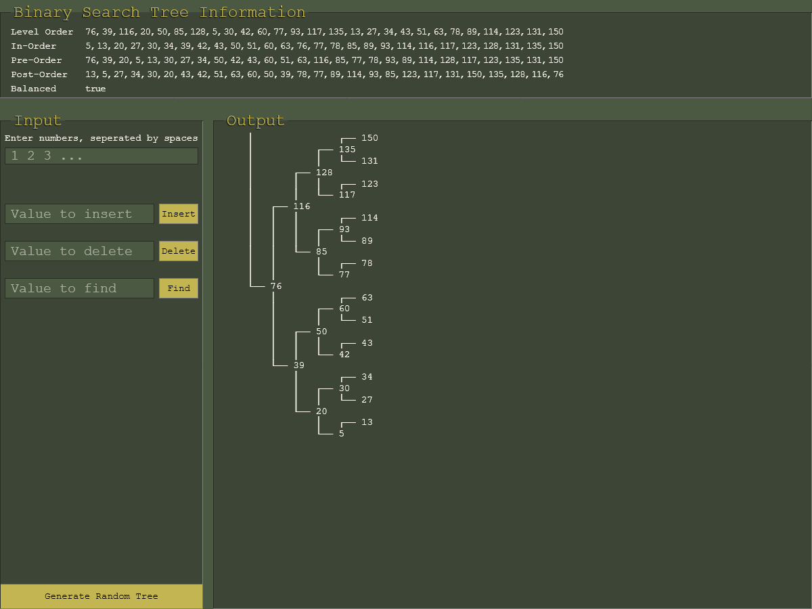

# [Balanced Binary Search Tree Visualizer](https://cmringmaker.github.io/balanced-BST/)

A visual tool for exploring balanced binary search trees with interactive controls and real-time tree visualization.



## Features

- **Interactive Tree Building**: Create trees from custom arrays or use the random generator
- **Real-time Operations**: Insert, delete, and find nodes with immediate visual feedback
- **Tree Balancing**: Automatic balance detection with manual rebalancing option
- **Multiple Traversals**: View level-order, in-order, pre-order, and post-order traversals
- **Visual Tree Display**: ASCII art representation of the tree structure
- **Persistent Storage**: Trees are saved automatically to localStorage

## How to Use

### Custom Array Input

- Enter space-separated numbers in the top input field
- The tree updates in real-time as you type
- Example: `1 2 3 4 5 6 7 ...`

### Tree Operations

- **Insert**: Add new nodes to the tree
- **Delete**: Remove existing nodes (with validation)
- **Find**: Search for specific values
- **Balance**: Rebalance unbalanced trees (button appears only when needed)
- **Random**: Generate a random tree with 30 nodes

### Tree Information

The left panel displays:

- Level-order traversal
- In-order traversal (sorted order)
- Pre-order traversal
- Post-order traversal
- Balance status (red when unbalanced)

## Technical Details

- Built with vanilla JavaScript (ES6 modules)
- Uses localStorage for persistence
- Implements self-balancing BST algorithms
- Clean, semantic HTML with CSS Grid layout
- Responsive design with retro Steam aesthetic

## Project Structure

```
├── assets/          # Images and icons
├── css/            # Stylesheets
├── js/             # JavaScript modules
├── index.html      # Main HTML file
└── README.md       # This file
```

## Getting Started

1. Clone this repository
2. Open `index.html` in a modern web browser
3. Start building and exploring binary search trees!

No build process or dependencies required - just open and run.

## Author

[@Ringmaker](https://github.com/cmRingmaker)
